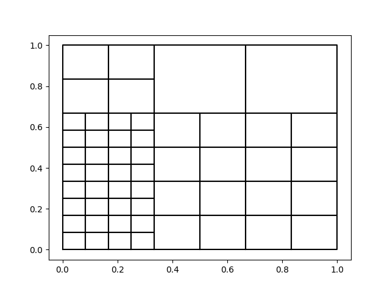
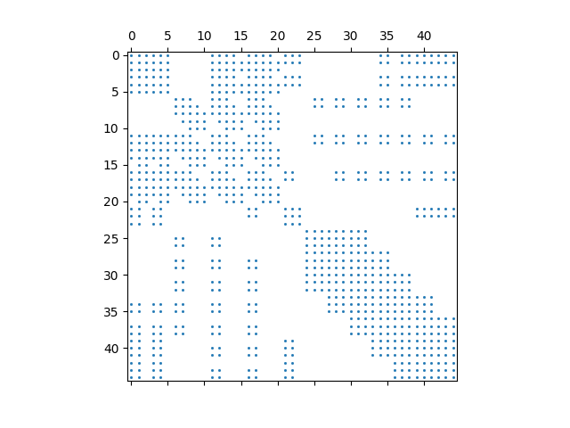

# THBSplines
## Truncated Hierarchical B-Splines in Python

This repository contains a dimension-independent Python-implementation of truncated hierarchical B-splines, and methods for the assembly of stiffness
and mass matrices. The code is currently in a fairly undocumented state, and may contain bugs - so use at your own discretion.

The implementation is based on the article [Algorithms for the implementation of adaptive isogeometric methods using hierarchical B-splines](https://doi.org/10.1016/j.apnum.2017.08.006),
and is heavily influenced by the [GeoPDEs](http://rafavzqz.github.io/geopdes/) Matlab/Octave package for isogeometric analysis developed by the authors.

## Example - computing the mass and stiffness matrix

The computation of finite element matrices is fairly simple. Initialize the hierarchical space. Refine the space by choosing specific elements, or a rectangular region of refinement, and finally, assemble the matrices.

```python
import THBSplines as thb
import matplotlib.pyplot as plt

# Initialize a biquadraic space of Truncated Hierarchical B-Splines
knots = [
  [0, 0, 1/3, 2/3, 1, 1],
  [0, 0, 1/3, 2/3, 1, 1]
]
degrees = [2, 2]
dimension = 2
T = thb.HierarchicalSpace(knots, degrees, dimension)

# Select cells to refine at each level, either by explicitly marking the elements, or by choosing a rectangular region.
cells_to_refine = {}
cells_to_refine[0] = [0, 1, 2, 3, 4, 5, 6]
T = thb.refine(T, cells_to_refine)

rect = np.array([[0, 1 / 3], [0, 2 / 3]])
cells_to_refine[1] = T.refine_in_rectangle(rect, level = 1)
T = thb.refine(T, cells_to_refine)
T.mesh.plot_cells()
```



```python
# If no integration order is specified, exact gauss quadrature suitable for the given basis is used.
mass_matrix = thb.hierarchical_mass_matrix(T)
stiffness_matrix = thb.hierarchical_stiffness_matrix(T)

plt.spy(mass_matrix, markersize=1)
plt.show()
```


